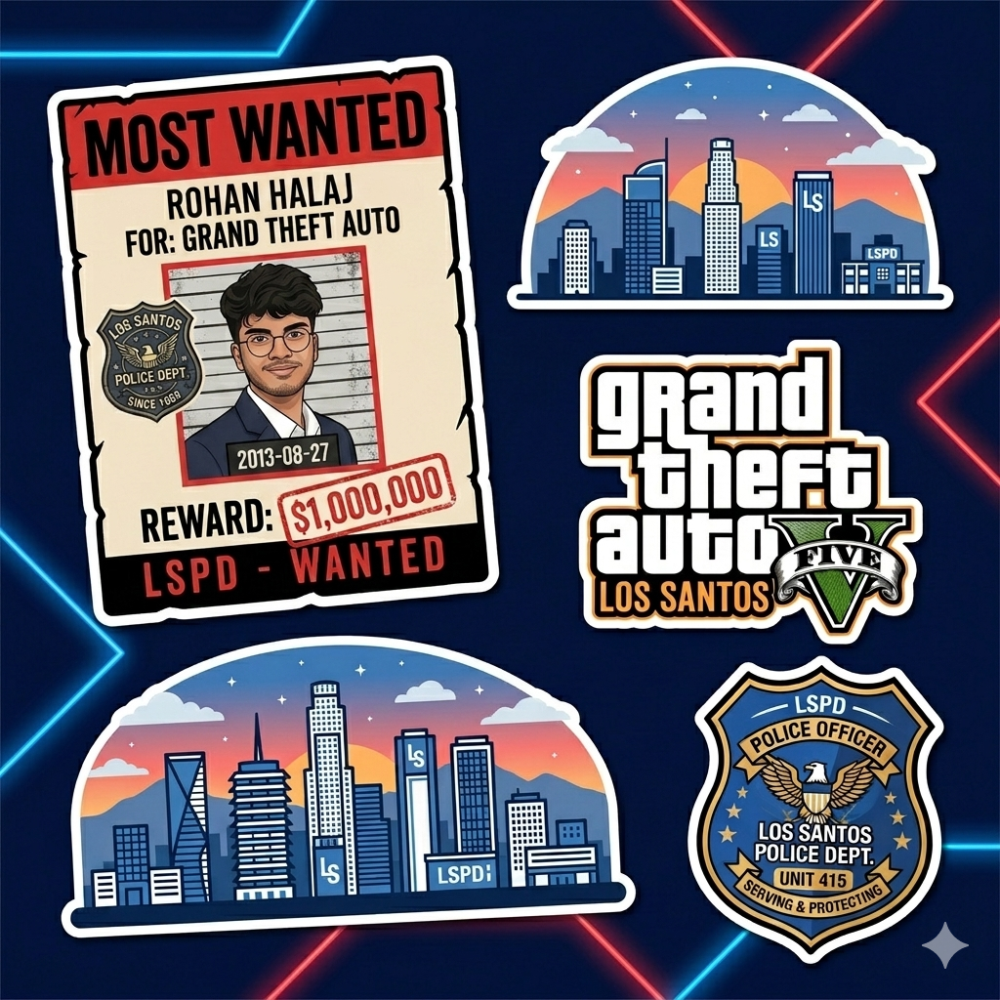

<!-- GTA 5 / LSPD BLUE HEADER -->

  

<!-- GTA LOADING SCREEN TYPING -->

  

<!-- WANTED LEVEL BADGES -->

  
  
  

<!-- GTA 5 STICKER PACK -->

  

<!-- CONTACT BUTTON -->

   

---

## 🚨 `LSPD DISPATCH — HEIST ARREST RECORD`
> *"The best crews work together. We didn't just win — we dominated."*

<table align="center" style="border-collapse: collapse; text-align: left; background-color: #030917;">
  <tr style="color: #90caf9;">
    <th style="padding: 10px;">⭐ Payout</th>
    <th style="padding: 10px;">🎯 Mission Name</th>
    <th style="padding: 10px;">📍 Location</th>
    <th style="padding: 10px;">🔫 Crew</th>
  </tr>
  <tr>
    <td style="padding:10px; color:#ef9a9a">💰💰💰 1st Place</td>
    <td style="padding:10px;"><b>TechSprint</b> <i>31 Jan 2026</i></td>
    <td style="padding:10px;">VTU, Belagavi (Google Dev Group)</td>
    <td style="padding:10px;">Rohan, Ashish, Nayana, Adil</td>
  </tr>
  <tr>
    <td style="padding:10px; color:#ef9a9a">💰💰💰 1st Place</td>
    <td style="padding:10px;"><b>HackAura 2026</b> <i>11–14 Mar 2026</i></td>
    <td style="padding:10px;">GIT Belagavi</td>
    <td style="padding:10px;">Rohan, Ashish, Nayana, Adil</td>
  </tr>
  <tr>
    <td style="padding:10px; color:#aaaaaa">💰💰 2nd Place</td>
    <td style="padding:10px;"><b>Mini Hackathon</b> <i>11–12 Apr 2026</i></td>
    <td style="padding:10px;">KLE Tech Univ (ITS IEEE)</td>
    <td style="padding:10px;">Rohan, Ashish, Nayana, Adil</td>
  </tr>
  <tr>
    <td style="padding:10px; color:#aaaaaa">💰💰 2nd Place</td>
    <td style="padding:10px;"><b>Nexora</b> <i>11 Oct 2025</i></td>
    <td style="padding:10px;">Jain College, Belagavi</td>
    <td style="padding:10px;">Rohan, Ashish, Adil, Saish</td>
  </tr>
</table>

---

## 🗺️ `MISSION BRIEFING — SKILL SET`

  
🔫 <b>[ OPEN ARSENAL ] — Click to arm up!</b>

   

> *"A good cop knows his tools. A great developer knows his full stack."*

  

    <b>🔧 Primary Weapons (Languages):</b> 
      
    <b>🚗 Vehicles (Frameworks):</b> 
      
    <b>🏠 Safe Houses (Infra & Cloud):</b> 
     
  

  
🏎️ <b>[ ACTIVE MISSIONS ] — Click to view case files!</b>

   

> *"Every project is a heist. Plan it. Execute it. Collect the payout."*

  <table align="center" style="border-collapse: collapse; text-align: center;">
    <tr>
      <td width="50%" style="padding: 15px;">
        <b>🧠 NoteConnect</b> 
        <i>P2P Notes Platform</i> 
         
        
      </td>
      <td width="50%" style="padding: 15px;">
        <b>💬 Real-Time Chat App</b> 
        <i>WebSockets + JWT Auth</i> 
         
        
      </td>
    </tr>
    <tr>
      <td width="50%" style="padding: 15px;">
        <b>🤖 AI RAG System</b> 
        <i>LangChain + Vector DB</i> 
         
        
      </td>
      <td width="50%" style="padding: 15px;">
        <b>📊 Task Manager</b> 
        <i>Multi-user Dashboard</i> 
         
        
      </td>
    </tr>
  </table>

 

---

<!-- LSPD STICKER BANNER -->

  

## 📊 `LSPD CRIMINAL RECORD — GITHUB STATS`

> *"They say your commit history never lies."*

  
  

  

---

## 🐍 `CHASE CAM — CONTRIBUTION TRAIL`

> *"Six stars and still coding. The LSPD can't catch this streak."*

  <a href="https://github.com/rohanhalaj18/rohanhalaj18/actions">
    <picture>
      <source media="(prefers-color-scheme: dark)" srcset="https://raw.githubusercontent.com/rohanhalaj18/rohanhalaj18/output/github-contribution-grid-snake-dark.svg">
      <source media="(prefers-color-scheme: light)" srcset="https://raw.githubusercontent.com/rohanhalaj18/rohanhalaj18/output/github-contribution-grid-snake.svg">
      
    </picture>
  </a>

---

## 📡 `RADIO: CONTACT YOUR CREW`

> *"Every legend needs a team. Slide into the comms."*

  
  
    
  

 

<!-- GTA LSPD FOOTER -->

  

<!-- 

  

 -->
