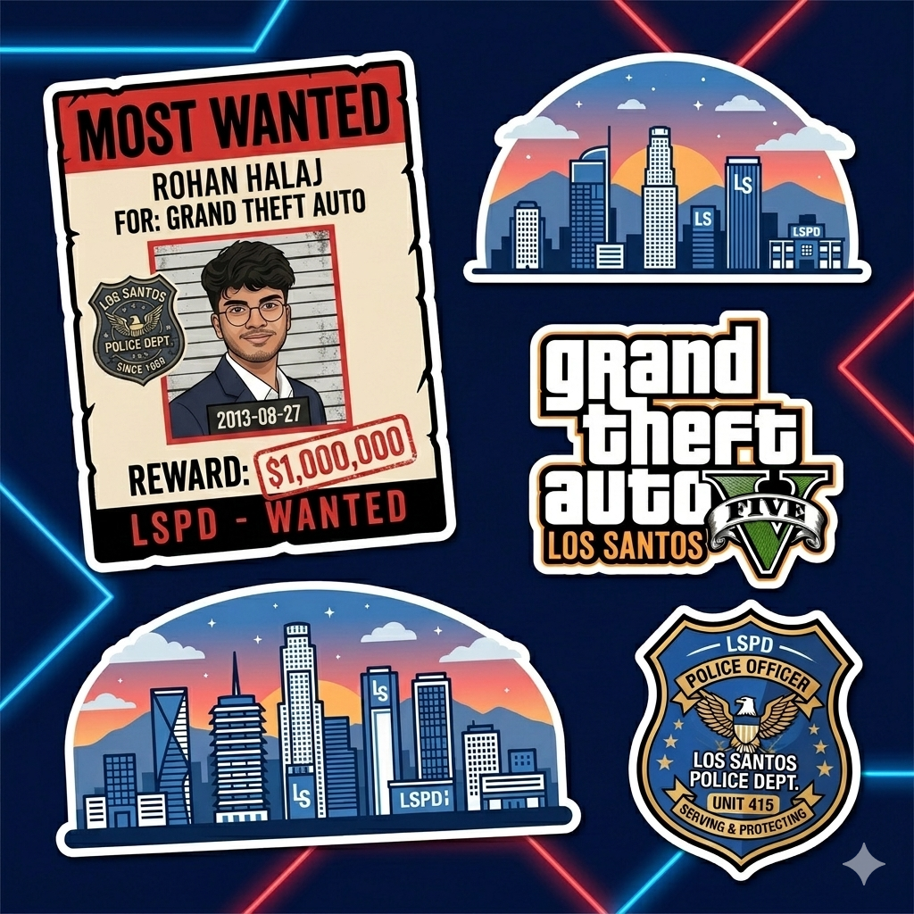

  

  
  
  

  

  

---

## About

I build full-stack applications with a focus on clean product experiences, practical AI systems, and reliable backend foundations.

> Building software that feels simple, useful, and finished.

- Currently exploring AI-powered apps, RAG workflows, and real-time web systems.
- Comfortable moving across frontend, backend, databases, and deployment.
- Hackathon winner with experience shipping under pressure with focused teams.
- Based in India, building projects that are useful, fast, and polished.

---

## Current Focus

- Building production-ready full-stack projects.
- Learning deeper AI and RAG application patterns.
- Improving system design, deployment, and product polish.

---

## Tech Stack

  

---

## Featured Projects

| Project | Focus | Stack | Status | Links |
| --- | --- | --- | --- | --- |
| **NoteConnect** | Peer-to-peer notes platform | Full stack, auth, database | Building | Coming soon |
| **Real-Time Chat App** | Live messaging with protected sessions | WebSockets, JWT, Node.js | Building | Coming soon |
| **AI RAG System** | Retrieval-augmented AI assistant | LangChain, vector database | Exploring | Coming soon |
| **Task Manager** | Multi-user productivity dashboard | React, API, database | Building | Coming soon |

---

## Hackathon Record

| Result | Event | Date | Location | Team |
| --- | --- | --- | --- | --- |
| **1st Place** | TechSprint | 31 Jan 2026 | VTU, Belagavi | Rohan, Ashish, Nayana, Adil |
| **1st Place** | HackAura 2026 | 11-14 Mar 2026 | VSM College, Nipani | Rohan, Ashish, Nayana, Adil |
| **2nd Place** | Mini Hackathon | 11-12 Apr 2026 | KLE Tech University | Rohan, Ashish, Nayana, Adil |
| **2nd Place** | Nexora | 11 Oct 2025 | Jain College, Belagavi | Rohan, Ashish, Adil, Saish |

---

## GitHub Dashboard

  
  

  

  

---

## Contribution Trail

  <a href="https://github.com/rohanhalaj18/rohanhalaj18/actions">
    <picture>
      <source media="(prefers-color-scheme: dark)" srcset="https://raw.githubusercontent.com/rohanhalaj18/rohanhalaj18/output/github-contribution-grid-snake-dark.svg">
      <source media="(prefers-color-scheme: light)" srcset="https://raw.githubusercontent.com/rohanhalaj18/rohanhalaj18/output/github-contribution-grid-snake.svg">
      
    </picture>
  </a>

---

  

  Clean systems. Useful products. Quietly cinematic code.

  

