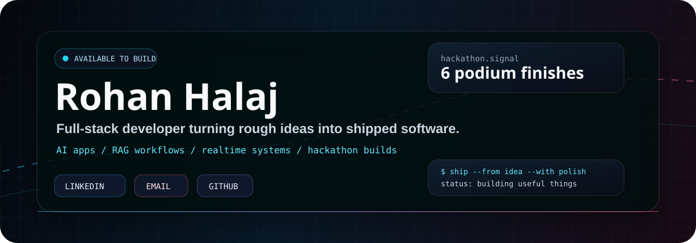

  

  <a href="https://linkedin.com/in/rohan-halaj"><strong>LinkedIn</strong></a>
  &nbsp;&nbsp;·&nbsp;&nbsp;
  <a href="mailto:rohanhalaj@gmail.com"><strong>Email</strong></a>
  &nbsp;&nbsp;·&nbsp;&nbsp;
  <a href="https://github.com/rohanhalaj18"><strong>GitHub</strong></a>

  

---

## Hello, I'm Rohan 🌱

I build full-stack applications the way a forest grows — strong roots, steady layers, room to breathe.

> Building software that feels simple, useful, and finished.

- Currently exploring AI-powered apps, RAG workflows, and real-time web systems.
- Comfortable moving across frontend, backend, databases, and deployment.
- Hackathon winner with experience shipping under pressure with focused teams.
- Based in India, building projects that are useful, fast, and polished.

  
  
  

---

## Current Focus

- 🌿 Growing production-ready full-stack projects.
- 🍄 Learning deeper AI and RAG application patterns.
- 🏔️ Improving system design, deployment, and product polish.

---

## Tech Stack

  

---

## Featured Projects

| Project | Focus | Stack | Status | Links |
| --- | --- | --- | --- | --- |
| **NoteConnect** | Peer-to-peer notes platform | Full stack, auth, database | 🌱 Growing | Coming soon |
| **Real-Time Chat App** | Live messaging with protected sessions | WebSockets, JWT, Node.js | 🌱 Growing | Coming soon |
| **AI RAG System** | Retrieval-augmented AI assistant | LangChain, vector database | 🔎 Exploring | Coming soon |
| **Task Manager** | Multi-user productivity dashboard | React, API, database | 🌱 Growing | Coming soon |

---

## Hackathon Trail

| Result | Event | Date | Location | Team |
| --- | --- | --- | --- | --- |
| 🥇 **1st Place** | TechSprint | 31 Jan 2026 | VTU, Belagavi | Rohan(Lead), Ashish, Nayana, Adil |
| 🥇 **1st Place** | HackAura 2026 | 11-14 Mar 2026 | VSM College, Nipani | Rohan(Lead), Ashish, Nayana, Adil |
| 🥈 **2nd Place** | Mini Hackathon | 11-12 Apr 2026 | KLE Tech University | Rohan, Ashish, Nayana, Adil |
| 🥈 **2nd Place** | Nexora | 11 Oct 2025 | Jain College, Belagavi | Rohan(Lead), Ashish, Adil, Saish |
| 🥈 **2nd Place** | YUGMA TechFest 2.0 | 24-25 July 2026 | Jawaharlal Nehru New College of Engineering (JNNC) | Rohan, Ashish, Adil, Nayana |
| 🥈 **2nd Place** | Minecraft 2K26 | 3-4 Oct 2026 | CSI Student Chapter, D. Y. Patil College of Engineering & Technology, Kolhapur | Rohan(Lead), Ashish, Adil, Nayana |
| 🥉 **3rd Place** | Hack Genesis | 7-8 Aug 2026 | KLE Tech University | Rohan(Lead), Ashish, Adil, Nayana |

---

## Badges

  

---

## Growth Rings

  
  

  

---

## Contribution Trail

  <a href="https://github.com/rohanhalaj18/rohanhalaj18/actions">
    <picture>
      <source media="(prefers-color-scheme: dark)" srcset="https://raw.githubusercontent.com/rohanhalaj18/rohanhalaj18/output/github-contribution-grid-snake-dark.svg">
      <source media="(prefers-color-scheme: light)" srcset="https://raw.githubusercontent.com/rohanhalaj18/rohanhalaj18/output/github-contribution-grid-snake.svg">
      
    </picture>
  </a>

---

  

  Rooted in curiosity. Growing every day. 🌲

  

